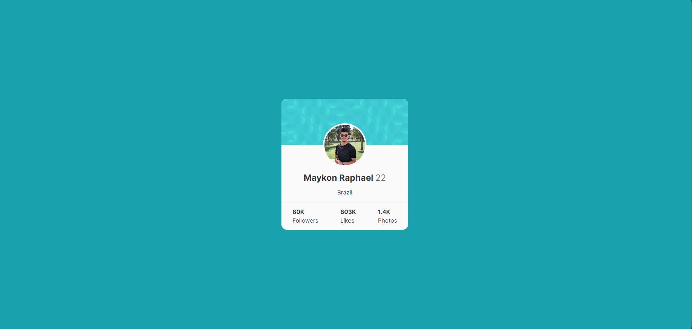

<p align="center">
  <a href="#project">Project</a>&nbsp;&nbsp;&nbsp;|&nbsp;&nbsp;&nbsp;
  <a href="#-technologies">Technologies</a>&nbsp;&nbsp;&nbsp;|&nbsp;&nbsp;&nbsp;
  <a href="#-Getting started">Getting started</a>&nbsp;&nbsp;&nbsp;|&nbsp;&nbsp;&nbsp;
</p>

<br>

---
<h1 align="center">
    
</h1>


## 💻 Project

Projeto desenvolvido para uma aula de HTML e CSS para a faculdade de Engenharia da Computação no UNASP-SP, o objetivo é criar um card de perfil para mostrar informações como nome, idade, nacionalidade e informações de redes sociais.

## 🧪 Technologies

This project was developed using the following technologies:
 
- [HTML](https://developer.mozilla.org/pt-BR/docs/Web/HTML)
- [CSS](https://developer.mozilla.org/pt-BR/docs/Web/CSS)

## 🚀 Getting started

Clone the project and access the folder.

```bash
$ git clone https://github.com/MaykonRaphael/html-college-activity-perfil.git
$ cd html-college-activity-perfil
```

Open the index.html in your browser or start the Go Live in your VS Code